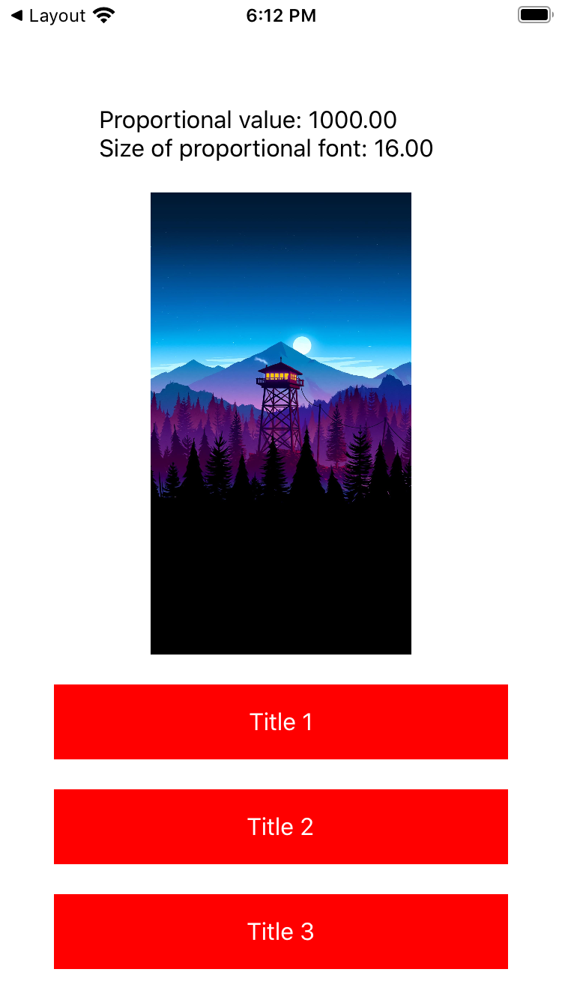
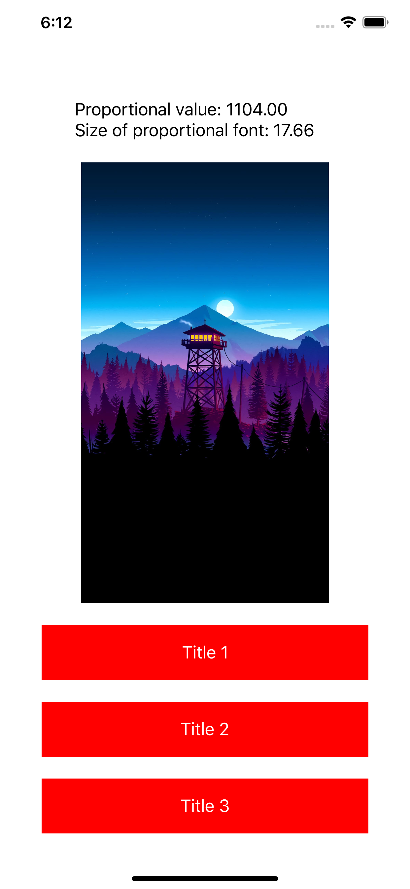

# Proportional size

**Proportional size** goals is to make available sizes proportional to the device used, helping to create a layout more similar to prototypes. Written in Swift.

### iPhone SE

### iPhone 8

### iPhone 11 Pro Max

## Features

- [x] Change values according device width size
- [x] Set base device width size
- [ ] Tests
- [ ] Enum with width devices

## Credits

**Proportional size** is owned and maintained by the Vitor Silveira. You can follow me on Twitter at [@vitusilveira31](https://twitter.com/vitusilveira31) for project updates and releases.

This library was inspired by [Layout Helper](https://github.com/tryWabbit/Layout-Helper) for iOS and [SDP](https://github.com/tryWabbit/Layout-Helper) for Android.

## License

**Proportional size** is released under the MIT license.
